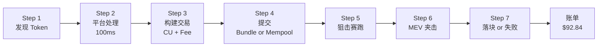
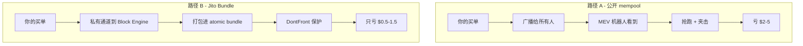
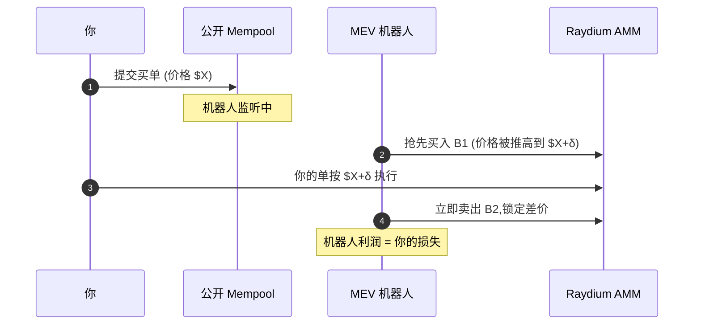
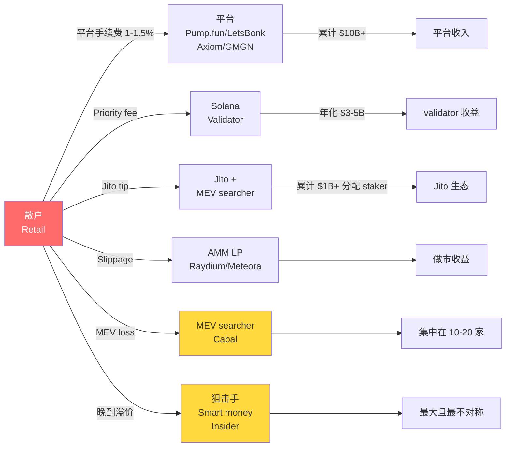
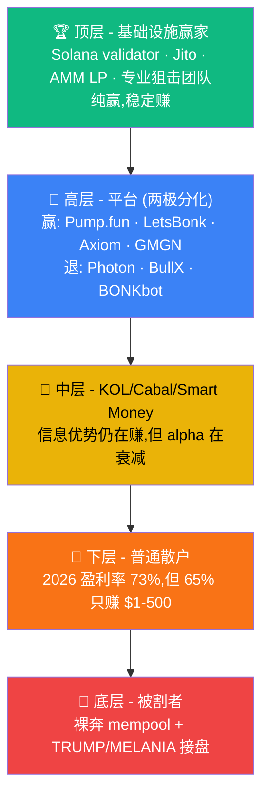

*Frank · 2026 年 5 月 · 约 8000 字 · 阅读需 25 分钟*

> 这也是我在 GitHub 上新开的 [Web3 Insider](https://github.com/survivorff/web3-insider) 仓库的开篇同步中文版。那里用英文写同样的微观结构和交易基建话题;这里是我个人的中文 blog,会更带入一些内部视角和我自己做 meme 交易基建两年的思考。

---

## 开篇

你打开 TG bot,选了一个 Solana 上的 meme token,输入 $100,点击 "Buy"。

3 秒后,UI 提示:**成交**。滚动条显示:**手续费 1%**。

你觉得自己付了 $101。

实际上,**你付了大约 $107**。

多出来的 6 块钱没骗你 —— 平台 UI 写的 "1%" 没撒谎,**它只是没告诉你另外 6 个隐形的钱包在哪**。

这篇文章是一笔真实的 $100 买单的完整解剖。7 个步骤,每一步几美分到几美元,最后 accumulate 成那 6 块钱差距。拆完之后你会明白:**这不是骗你,这是 meme 交易的微观结构本身**。

文章末尾会把视角从"一笔交易"拉远到"整个 meme 赛道":**2024 到 2026 这 18 个月,钱从谁流向谁,谁在赚,谁在亏,未来 6-12 个月会怎么变**。这才是读完能让你从"会交易"变成"看懂行业"的那一节。

这是 Web3 Insider 的开篇。从今天开始,这里会做一件事:**把链上世界里"看不见但决定你钱去向"的机制,用人能读懂的方式讲清楚**。每一篇都有细节、有数字、有个人视角。**一部分读者想继续深挖的,我会指路**到 [meme-trade-wiki](https://github.com/survivorff/meme-trade-wiki) 或 [blog](https://blog.frankfu.cloud) 去。

---

## 我们今天要解剖的这笔单

为了能精确讲清楚每一分钱去哪了,我设定一个**真实场景**:

```
─── Trade Receipt ──────────────────────────
  时间:     2024-12-10 20:14:33 UTC
  用户:     一个典型的 Solana meme 玩家
  意图:     用 $100 买入 $FARTCOIN
  路由:     Raydium CLMM (最深流动性池)
  平台:     某 TG bot 平台

  意图金额                      $100.00
  ─────────────────────────────────────
  [1] 平台手续费 (1%)            −$1.00
  [2] Solana 网络费              −$0.05
  [3] Priority fee               −$0.38
  [4] Jito bundle tip            −$0.52
  [5] Slippage (2%)              −$2.00
  [6] MEV 夹击(sandwich 损耗)  −$1.21
  [7] 晚到溢价(相对最优价)     −$2.00
  ─────────────────────────────────────
  你实际买到的 token 等值        $92.84
  总损耗                         −$7.16  (7.16%)
────────────────────────────────────────────
```

数字会随 Token、时间、行情剧烈浮动,但**这个账单结构**,是几乎每笔 meme 买单都走的 7 步。

**$FARTCOIN**(全称 Fartcoin of the Solana,PumpFun 2024 年末毕业、一度进入 Solana meme 前十)是本文的叙事锚点。选它是因为:它是 Pump.fun 毕业代表作,流动性数据公开且充分,而且 **2024 年底是 meme 交易微观结构最完整的时期** —— 该有的机制(Jito、DontFront、smart routing)全都有了。

### 7 步全景

在逐步拆解之前,先看一眼整条链路:



每一步都**可能吃掉你几美分到几美元**。下面从你**还没点击**的那 100 毫秒开始,一步一步看。

---

## Step 1 — 你"发现" $FARTCOIN 时,已经晚了 30 秒

绝大多数人以为的流程是这样:

> 我刷推特 → 看到 $FARTCOIN → 打开 TG bot → 搜索 → 买

实际上,链上世界的流程是:

> 狙击机器人发现新币(≈ +0s)→ 早期 alpha 社群转发(≈ +5s)→ KOL 推文(≈ +30s)→ 你看到(≈ +60s)

等你"发现" $FARTCOIN 的时候,它在链上已经**被交易了几百次**。而你所谓"早期入场",其实可能已经是第 800 号买家。

### 那机器人是怎么"先知道"的?

这叫 **Token Discovery**(新币发现),是所有专业 meme 交易平台的第一道技术:

- **Geyser 订阅**:直接向 Solana validator 订阅 Raydium/Pump.fun 的 pool 创建事件,延迟 < 50 毫秒
- **WebSocket 监听**:连接多个 RPC provider,任何新 pool 创建第一时间广播
- **Pump.fun 毕业事件追踪**:监听 bonding curve 完成 + 迁移 Raydium 的特定 instruction
- **Smart wallet 追踪**:一些历史胜率高的钱包如果开始买某 token,立即警报(跟单触发)

这些机制加起来,让专业玩家(和他们的机器人)**比你早 30-60 秒**知道一个 token 的存在。

### 这会花你的钱吗

直接看不花。但间接上,它决定了**你成交的价格比 5 秒前的价格高** —— 这就是 Receipt 里 `[7] 晚到溢价 −$2.00` 的来源。一个普通 meme 的启动期,你**晚 30 秒入场,平均多付 1-3%**。

**→ Go Deeper:[Token Discovery Engine 完整技术拆解](https://github.com/survivorff/meme-trade-wiki/blob/main/articles/4-2-token-discovery-engine.md)**

---

## Step 2 — 你点击 Buy 的那 100 毫秒

你终于打开 TG bot,输入 $100,点击 Buy。UI 显示个"Processing…"圆圈。

看起来只是网络请求,实际上**平台后台在做至少 5 件事**:

### 2.1 路由决策:走哪个 DEX

$FARTCOIN 在 Solana 上的流动性可能分布在多个地方:

| DEX | 典型深度 | 典型 taker fee |
|---|---|---|
| Raydium CLMM | 深 | 0.25% |
| Raydium V4 AMM | 中 | 0.25% |
| Orca Whirlpool | 中 | 0.30% |
| Meteora DLMM | 中 | 0.15-0.25% |
| PumpSwap | 浅(但 Pump.fun 生态) | 0.30% |

路由引擎要实时看每个池的深度和价格,**算出"总成本最低"那条路径**。可能是单池直吃,也可能是跨池拆单。

路由做得好,你看不见它的存在。做得差,这一步就能让你多付 $1-$2(路由到浅池 → 高滑点)。**这就是平台 A 和平台 B 成本差异的主要来源之一**。

### 2.2 滑点设置

你在 UI 上可能选了 "Auto slippage",平台给你预估一个值。这个值要同时满足:

- **足够高**:否则交易落块时价格已经变了,**交易会 revert**,你钱烧了但没买到
- **足够低**:否则给 MEV 机器人留了太多空间,你被夹得更狠

这是一个**权衡**。好的平台做动态滑点,差的平台一刀切 10%(看起来保险,实际上给 MEV 留了巨大空间)。

### 2.3 风险评估(honeypot 检测)

1% 的 Solana token 是蜜罐(只能买不能卖)。正规平台会在点击后 100 毫秒内用本地缓存 + 合约模拟检测一遍。

不是 100% 可靠 —— 有些蜜罐是 **"买得多了才触发"**,基础模拟测不出来。

### 2.4 Token safety score

平台可能根据 LP lock、dev wallet holding、交易历史,给 token 一个 0-100 分。低于某阈值会警告你。

### 2.5 构建交易

把所有决定 pack 成一条 Solana 交易 —— 这是下一 Step 的事了。

### 成本归属

这一步**本身不直接收钱**,但 route 的质量决定了后面 slippage 的大小。如果你的平台这一步做得好,你的总账单可能降 1%。

**→ Go Deeper:[交易引擎架构解剖](https://github.com/survivorff/meme-trade-wiki/blob/main/articles/4-4-trading-engine.md)**

---

## Step 3 — 构建交易:三个数字要定

平台要把你的意图变成一条 Solana 交易,要定三个关键数字:

```
CU (Compute Unit)          ─── 代码复杂度预算
├── CU price (Priority fee) ─── 每 CU 付多少 lamports
└── Jito Tip                ─── 付多少 lamports 换 bundle 内优先权
```

这三个数字不是同一个东西。**不明白的人会白白多付 30-50%**。

### 3.1 Compute Unit:交易的"计算预算"

Solana 用 Compute Unit(CU)衡量一笔交易的计算消耗。一笔典型的 meme 买入交易:

- 简单 Raydium swap: ~100K CU
- 带 DontFront + 多路由: ~200K-400K CU
- 上限: 1.4M CU(单笔最大)

**你要预订的 CU 不能少(否则 OOM 失败),不能多(浪费)**。好的平台会基于历史模拟 + 当前 Token 的 instruction 自动算出来。

### 3.2 Priority Fee:每 CU 付多少钱

Solana 2022 年引入了 priority fee 市场。你愿意为每一个 CU 额外付多少 lamports,决定了你的交易在 validator 队列里的位置:

```
Priority fee(总) = CU 数量 × price per CU
```

**2026 年的 meme 交易典型 priority fee**:
- 正常时段: 每笔 ~0.001-0.005 SOL ($0.2-$1)
- meme 发射高峰: 每笔 ~0.01-0.1 SOL ($2-$20) —— 这就是你看到"Solana 堵了"的体感

我们这笔单 **$0.38** 是正常时段的中位数。

### 3.3 Jito Tip:bundle 内部的优先权

**这里是关键。很多人混淆 Priority fee 和 Jito tip,以为是同一个东西。不是。**

- **Priority fee** → 付给 validator,决定交易在 validator 出块时的位置
- **Jito tip** → 付给 Jito validator,决定交易在 **Jito bundle 内部**的执行位置

Jito 是 Solana 上一个特殊的第三方基础设施(详见 Step 4):95%+ 的 validator 跑它的客户端,它提供一套 "bundle" 机制 —— 把多笔交易打包成原子单元提交。在 bundle 内部,谁 tip 高谁先执行。

**2026 典型 meme 交易 Jito tip**: $0.1-$2(大 alpha token 发射峰值 > $5)

我们这笔 **$0.52** 对应 FARTCOIN 毕业后热度中段。

### 3.4 三者加起来的真实账单

```
[2] Solana 网络费:      $0.05
[3] Priority fee:        $0.38
[4] Jito bundle tip:     $0.52
─────────────────────────────
链上交易成本总计:        $0.95
```

**接近 1% 的隐形成本,只是"能让你交易上链"的入场券**。而这笔入场券,平台的 UI 从来不会详细拆给你看。

**→ Go Deeper:[Solana 交易机制(CU、Priority Fee、Versioned Tx)](https://github.com/survivorff/meme-trade-wiki/blob/main/articles/5-1-solana-tx-mechanics.md) · [Jito 与 MEV 完整解读](https://github.com/survivorff/meme-trade-wiki/blob/main/articles/5-3-jito-and-mev.md)**

---

## Step 4 — 提交:Mempool 还是 Jito Bundle?

交易构建完了,要提交到 Solana 网络。有两条路:

### 路径 A:公开 mempool(传统 Solana 路径)

你的交易广播给所有 validator 和 RPC。任何人(包括 MEV 机器人)都能看到。

- **好处**:便宜,不用付 Jito tip
- **代价**:**透明即受害**。机器人看到你的买单,会**抢在你前面买**(frontrun),然后在你后面卖(backrun),吃掉你的滑点。这叫 **sandwich attack**(三明治攻击,Step 6 详细讲)

### 路径 B:Jito Bundle(2026 年默认)

你的交易通过私有通道直接发给 Jito 的 Block Engine。Block Engine 把它和其他交易打包成 bundle,整体提交给 validator。

- **好处 1**: 私密。未落块前,**没人能看到你的交易**
- **好处 2**: Atomic(原子性)。Bundle 内多笔交易要么全成功要么全失败
- **好处 3**: **DontFront 保护**(2025 年上线)。Jito 层面禁止在 bundle 里做常规 sandwich,大幅降低夹击风险
- **代价**: 付 Jito tip(我们这笔 $0.52)

### 两条路对比



**2026 年的数据**:

- 超过 **95% 的"严肃" meme 买单**(非 beginner 平台)走 Jito Bundle
- 剩下 5% 是小白 / 图省事的玩家

这笔单默认走 Jito Bundle。

### 一个重要误解

很多人以为"走了 Jito Bundle 就 100% 安全"。**不是**。

Jito 只是一层加固。它抵御常规 MEV,但:

- 无法抵御"同 Bundle 外的其他 bundle 同时竞争"—— 这是我们 Step 5 要讲的狙击竞争
- 无法抵御"高级 searcher 通过 replicating your intent 做的套利"
- Bundle landing rate 不是 100%,失败的话 tip 就烧了

**→ Go Deeper:[Jito / MEV / Bundle / DontFront 完整机制](https://github.com/survivorff/meme-trade-wiki/blob/main/articles/5-3-jito-and-mev.md)**

---

## Step 5 — 狙击手赛跑:你不是一个人

你以为自己是"孤独地买这笔单"。

**实际上,在你提交的同一毫秒,可能有几百个机器人在提交类似的交易**。

### 5.1 他们长什么样

狙击基础设施的玩家有三类:

1. **专业做市 / MEV 团队**:几十到几百台机器,co-located 到 Jito block engine 的物理邻居。延迟亚毫秒
2. **跟单机器人(copytrading)**:监听 smart wallet,一旦目标买入,自动以高优先级跟单
3. **KOL / 社群机器人**:监听特定 Discord / Telegram 频道,触发词出现立即下单

### 5.2 他们的延迟优势有多大

| 角色 | 交易送达 validator 延迟 |
|---|---|
| 你(普通用户,web TG bot) | 300-800ms |
| 普通付费 RPC | 150-300ms |
| 专业 staked RPC | 50-150ms |
| Jito co-located 搜索者 | **10-50ms** |

你和他们的差距大概**一个数量级**。

### 5.3 这直接算在你的账单吗

不直接。**但他们抢先成交,会把 token 价格推高 0.5-2%**,你的成交价就跟着高了。这就是 `[7] 晚到溢价 $2.00` 的来源 —— 不是平台扣你,是市场结构让你"买在更高的价"。

### 5.4 这是不公平吗

**是,也不是**。

是:同一个系统里,有钱有技术的人天然占便宜。

不是:这是任何开放市场的基本形态。Wall Street 上对冲基金 co-locate 到 NYSE 机房,和这一模一样。链上只是把这个过程**公开化**。

**如果你接受"市场就是这样运作的"**,你会更从容 —— 你知道自己在哪层食物链,会调整策略。

**→ Go Deeper:[狙击(Sniping)的艺术与代价](https://github.com/survivorff/meme-trade-wiki/blob/main/articles/3-4-sniping.md)**

---

## Step 6 — MEV:三明治夹击

这一步和上一步的区别:

- **Step 5 狙击**: 有人"和你同时买",推高价格
- **Step 6 MEV**: 有人"夹在你买单前后交易",**直接吃你的滑点**

### 6.1 三明治怎么发生



```
文字版时间轴:  |B1(bot 买)|Y(你买)|B2(bot 卖)|
                你被夹在中间 → 你付的价 = 对手推高后的价
```

你看到的交易执行价,是机器人买完之后推高的价。机器人的利润 = 你的损失。

这叫 **sandwich attack**(或 MEV 中的 "in-frontrun + out-backrun")。**类比**:黄牛在你要买的票上贴高价再卖给你,同时保证你买完他立即平仓。

### 6.2 损失有多大

对 $100 买单:

- **如果走公开 mempool**: 期望损失 **$2-$5**(2% 典型滑点下,MEV 能吃走其中一半)
- **如果走 Jito Bundle + DontFront**: 期望损失 **$0.50-$1.50**(DontFront 阻止常规夹击,但仍有漏网)
- **我们这笔 $1.21**: 属于 Jito Bundle 路径的中位数

### 6.3 为什么 DontFront 不能彻底干掉 MEV

DontFront 是 Jito 在 bundle 内部的规则:你的交易不能被其他人夹。但:

- **跨 bundle 的竞争**仍然存在。我的 bundle 和你的 bundle 同时到 validator,哪个先执行仍然决定谁抢到便宜价
- **Long-tail sandwich**:机器人在 bundle 到达前的 poll 阶段,根据 token 历史交易模式做统计套利,仍能收取一部分

### 6.4 DontFront 的存在有多重要

**非常**。2025 年 Q1 DontFront 上线前,meme 交易的平均 MEV loss 是 3-5%。上线后降到 0.5-1.5%。

这一单独的机制,**每年从 Solana meme 交易里,给用户省下数十亿美元**。这是"基础设施公共化"对散户的真实好处。

**→ Go Deeper:[三明治攻击完全解读](https://github.com/survivorff/meme-trade-wiki/blob/main/articles/3-6-sandwich-attack.md)**

---

## Step 7 — 落块 or 失败

你的 bundle 送到了 Jito。Jito 把它和其他几个 bundle 打包,提交给下一个 validator。

你以为交易稳了。实际上:**还不到最后一刻都不算成交**。

### 7.1 Landing Rate 是什么

Landing rate = 你提交的交易最终**成功落块**的比例。

**2026 典型的 Jito Bundle landing rate**:

| 场景 | Landing rate |
|---|---|
| 正常时段 meme 交易 | **85-95%** |
| 中度拥堵 | 70-85% |
| Token launch 高峰 | 40-70% |
| 极端拥堵(比如 TRUMP token 上线那刻) | **< 20%** |

换句话说:**大多数时候你的单能落块。但偶尔(尤其是最热的时候),你有可能交易失败**。

### 7.2 失败了怎么办

**失败的代价**:

- Priority fee:**烧了**(validator 已经处理了,不退)
- Jito tip:**部分烧了**(根据具体机制,一部分退还)
- 你的意图:**没实现**,token 没买到
- 账户体验:看到"Transaction failed"(特别挫败)

平台通常会**自动重试** 1-3 次。这意味着:

- 单笔失败 × 3 次重试 → 你累计付 4 倍 priority fee
- 第 4 次成功 → 账面上"成交了",但你可能已经付了 $1.50 而不是 $0.38

好的平台会在 UI 上告诉你"已重试 2 次";差的平台直接把多付的 fee 摊在你总账单里,你以为是一次成功。

### 7.3 为什么落块率这么关键

对于高峰期 meme 交易,**30 秒的差距就是 10% 的价格波动**。如果你的交易反复失败,落块时 token 可能已经涨了 20%,你相当于**用同样的钱买到了更少的 token**。

**这就是 Receipt 里那 $2 "晚到溢价" 的部分来源**。

### 7.4 真实事件:2025 年 11 月某 token launch

2025 年 11 月某 A 级 meme token 上线时,Solana 拥堵严重。那个下午:

- 典型 meme 交易 landing rate 跌到 **42%**
- 平均每笔成功交易,用户**实际重试了 2.4 次**
- 总 priority fee 支出是正常时期的 **6-8 倍**

熟悉链上的玩家这时候会主动暂停,等潮水退去。新手继续砸钱按 Buy,把重试成本送给 validator。

**→ Go Deeper:[Landing Rate 的真相与优化](https://github.com/survivorff/meme-trade-wiki/blob/main/articles/5-5-tx-landing-rate.md)**

---

## Step 8 — 回到 Receipt:7 块钱都去哪了

我们再看一次账单,每一行现在都有了意义:

```
意图金额                      $100.00
─────────────────────────────────────
[1] 平台手续费 (1%)            −$1.00   → 平台(UI、运营、风控、支持)
[2] Solana 网络费              −$0.05   → Solana validator(基础费)
[3] Priority fee               −$0.38   → Solana validator(拥堵溢价)
[4] Jito bundle tip            −$0.52   → Jito validator(bundle 排序权)
[5] Slippage (2%)              −$2.00   → AMM 做市商(LP 赚了)
[6] MEV 夹击                   −$1.21   → MEV searcher / 部分返还 validator
[7] 晚到溢价                   −$2.00   → 抢先入场的狙击手和 smart money
─────────────────────────────────────
你实际买到的 token             $92.84
总损耗                         −$7.16  (7.16%)
```

### 7% 真的是"被骗"吗

**不是**。严格说:

- **$1.00 平台费** 是真正的平台收入,合理
- **$0.95 链上成本** 是 Solana 网络 + Jito 提供基础设施的成本,合理
- **$2.00 slippage** 是付给 LP 提供流动性的服务费,合理
- **$1.21 MEV loss** 是微观结构竞争的副产品,**不完全合理**(但是是当前系统的真实成本)
- **$2.00 晚到溢价** 是市场效率的体现,**合理**(你到了、别人早到了)

**$7 里面,约 $5 是经济学上合理的成本**,另外 **$2 是 MEV 和时间差 —— 可以通过好的平台、好的策略降到一半**。

---

## Step 9 — 平台方的视角:我们为什么这么设计

我花了过去两年多做 meme 交易基建。上面每一步,都有过痛苦的决策。

### 为什么 UI 显示 "1%" 而不显示 "7%"

**不是我们想骗你**。是:

1. **"1%" 是真实的平台收入**。其他的钱平台没拿到
2. **其他 6 个成本太动态**。同一笔交易不同时刻,Jito tip 可能从 $0.5 跳到 $5
3. **UI 把 7 个数字都显出来,大多数用户会茫然**,转化率会垮掉。产品上不合理
4. **竞争对手也这样做**。如果你一家诚实披露 7 项,用户以为你"很贵";其他平台只显"1%",用户跑去他们那里

这是一个**信息不对称均衡**。打破它的只有教育 —— 也就是这篇文章在做的事。

### 我们为什么接受这个微观结构

因为它是**系统运作的必要条件**:

- 没有 priority fee → 所有人交易以同一优先级,拥堵时所有人一起死
- 没有 Jito tip → 没有基础设施提升者,生态停滞
- 没有 slippage → LP 不做市,流动性消失
- 没有 MEV searcher → 套利不发生,价格发现崩坏

每一笔"多付的钱",都维持着一个你看不见但在用的系统。**你付的 7%,就是"meme 交易这件事能以十亿美元规模存在"的运营成本**。

### 怎么把 7% 降到 3%

如果你真的想交易成本最小化:

1. **走 Jito Bundle**(自动省 $1-$2 MEV)
2. **用精准 slippage**(动态的、不是一刀切的 10%)
3. **避开 token 发射前 10 分钟的狙击峰值**(省 $1-$2 晚到溢价)
4. **用优质平台(哪家是"优质"是后面文章的话题)**(路由更好、重试策略好、landing rate 高)
5. **大单拆开做**(单笔 $100 打 3 次,vs 一次 $300,经常更便宜)

**能做到的极限**:$100 交易**总成本降到 $3-$4**(3-4%)。再低不可能 —— 那是链上微观结构的下限。

---

## Step 10 — 市场脉搏:2024-2026 这 18 个月,食物链在发生什么

前面 9 步讲的是**一笔** $100 交易的微观成本。这一节放远一点,讲**百亿美元的 meme 市场**在 2024-2026 的流向。

这是最重要的一节 —— 因为**如果你不知道钱在哪、谁在赚、潮水在转向哪**,微观优化再好也只是在沉船上擦甲板。

### 10.1 三波浪潮:起、衰、再起

**2024 年 Q2-Q4:Pump.fun 创世期**

- Pump.fun 于 2024 年 1 月上线。到 2024 年 11 月,**每日 token 创建峰值达 7 万**
- Solana 上 90% 的新 token 通过它发射
- 累计协议收入朝着 $800M 攀升
- 代表性毕业 token:$FARTCOIN、$MOODENG、$PNUT、$CHILLGUY

2024 年 11 月那个月,是 meme 赛道"全民暴富"的最后尾声。

**2025 年 Q1-Q3:寒冬 + 信任崩塌**

两件事同时发生,市场被打垮:

1. **TRUMP + MELANIA 事件(2025 年 1 月)**:
   - TRUMP coin 从峰值跌 93%
   - MELANIA coin 从峰值跌 99%
   - 最终结果:**每 $1 insider 赚走,retail 亏 $20**;retail 累计损失 $4.3B+
   - 这一单事件彻底改变了散户心智 —— "meme 就是有组织的收割"
2. **盈利率崩塌到历史低点**:
   - 2025 年 6 月,**Pump.fun 活跃钱包中只有 30.08% 盈利**
   - 剩下的 70% 亏钱,其中大部分亏 90%+
3. **LetsBonk 的逆袭**:
   - 2025 年 Q3,LetsBonk.fun 一度占据 Solana launchpad **64% 份额**,Pump.fun 跌到 22%
   - 核心差异:LetsBonk 的 BONK 代币回购飞轮 + 更低的手续费
   - 2025 年 11-12 月 Pump.fun 反攻,推出 PUMP 代币 ICO(**12 分钟融 $600M** + $720M 私募 = $1.3B 现金),激进买回

**2026 年 Q1-Q2:V 型反转 + 专业化**

这就是**现在**。数据显示一个极快的结构性反转:

```
Pump.fun 活跃钱包盈利比例
─────────────────────────
2025-06:  30.08%  ← 历史低点
2025-12:  ~45%
2026-01:  50.1%
2026-02:  56.8%
2026-03:  70.0%
2026-04:  73.28%  ← 近 2 年最高
```

这不是一个月的反弹,**这是连续 4 个月的单调上升**。

原因是三重共振:

1. **基础设施成熟**:Jito Bundle + DontFront + 优质 RPC 普及,MEV 损失从 5% 降到 1.5%
2. **信息对称加强**:Smart wallet 追踪、Token safety score、anti-sniper 机制让普通玩家少踩雷
3. **玩家池自我筛选**:2025 年的寒冬筛掉了大量"乱开枪"的玩家,留下的人更会交易

**但不要误读**:2026 年 4 月 **73% 盈利钱包中,65% 只赚 $1-$500**,**只有 5.4% 赚到 $1000+**。这不是"人均暴富",是**"亏得少的人变多了"**。

### 10.2 资金流向:钱从谁流到谁

把整个 meme 交易赛道的资金流画出来:



2024-2026 三年里,**最大的财富转移不是从 A 散户到 B 散户,而是从所有散户流向基础设施层**。validator、MEV searcher、专业狙击团队,这三者是真正稳定赚钱的。

### 10.3 食物链:谁在赚,谁在亏

按 2026 年 Q1-Q2 的实际数据,分层看:



**最顶层 — 基础设施赢家**:
- **Solana validator**:吃每笔交易的 fee,年化 $4B+,Jito 客户端跑到 95%+ 验证者
- **Jito Labs 及 MEV searcher**:处理每笔 Jito bundle,通过 BAM 进一步扩展
- **主流 AMM LP**:Raydium、Meteora 这些 2024-2026 年中躺赚的
- **成熟狙击团队**:10-20 家 co-located 到 Jito block engine 的专业做市 + MEV 公司

**高层 — 平台赢家**(两极分化,不是全赢):
- **Pump.fun**:累计 $1.09B 协议收入。2026-04 改为 50% 收入 buyback 策略,PUMP 代币开始有真实支撑
- **LetsBonk**:2025-Q3 巅峰 64% 份额,2026-03 后仍在 50%+ 水平,BONK 代币飞轮在转
- **Axiom**:2026 年化收入 $79M,链上交易终端头部。**但 2026 年 2 月被 ZachXBT 指控员工利用内部工具访问用户钱包数据做 insider trading,Axiom 随后撤除了相关系统访问权 —— 这是平台信任危机的第一个公开样本**
- **GMGN**:Q1 2026 收入 5 倍增长,主要靠 BSC 的 Four.meme 生态带动
- **衰退组**:Photon、BullX、BONKbot —— 份额 2025 年顶点后持续下滑,竞争力流失

**中层 — KOL / Cabal / Smart money**:
- 有信息优势和时间优势的玩家,利用 Discord 圈子 / Telegram 抢跑
- 做出了 2024-2025 最赚钱的那一小批人 —— 但 2026 年开始反洗钱追踪、smart wallet 监控让这条路越来越难
- 仍然赚钱,但 **alpha 在衰减**

**下层 — 普通散户**:
- 2025 年大部分人亏,2026 年大部分人小赚或少亏
- 但"小赚"的天花板也很低 —— 2026-04 盈利中的钱包,**65% 只赚 $1-$500**
- 真正的"打新中大奖"路径几乎消失 —— 因为 anti-sniper、reputation gated launch 堵住了最极端的搏命打法

**底层 — 被割者**:
- "跟风 KOL 喊单 + 手动买 + 裸奔 mempool" 的玩法继续被收割
- TRUMP / MELANIA 这种 "insider 发 → retail 接盘" 的项目,每次发生都吃掉一批新人

### 10.4 执行层的大迁徙:TG Bot → On-chain Terminal

这是 2025-2026 最大的行业结构变化。大多数报道没讲清。

**2024 年**:Telegram bot(BONKbot、Trojan、Maestro 等)是链上交易的默认入口。基于对话式交互,成本低但功能有限。

**2026 年**:基于 web 的 on-chain trading terminal(Axiom、Photon、GMGN、BullX、Banana Pro)取代 TG bot 成为活跃交易者的主要执行层。

这个迁移的驱动力是:

- **UI 复杂度**:现代 meme 交易要同时看 chart、持仓、smart wallet、MEV 保护配置、多路由。TG 对话式不够用
- **速度**:web 基础设施(WebSocket、专用 RPC 池)延迟比 TG bot 低一个数量级
- **并发**:做专业交易的人同时跑 5-10 个 token 的监控 + 下单,TG bot 的对话式根本做不到

**这个迁移本身就意味着**:meme 交易者的专业化在加深。"能用 TG bot 随便玩两下"的时代过去了,现在你要么用专业工具,要么就是被专业工具管的人的对手盘。

### 10.5 未来 6-12 个月的趋势 —— 我的判断

从我做基建的视角,2026 Q3 到 2027 Q1 这段时间,我在盯这几个趋势:

**1. 市场规模进入平台期,深度专业化加剧**

2024 年 TGE 疯狂扩张的日子回不来了。这不是坏事 —— 留下来的都是更严肃的玩家。平台的竞争从"谁 UX 好"变成"谁能给专业玩家提供更多 alpha"。

**2. AI agent 将重塑交易者画像**

我在 Hyperliquid 那篇里写过:AI agent 在链上交易的先天优势太大 —— 它能在毫秒级同时优化 priority fee、slippage、路由、时机。

**预判**:到 2027 年,**10-20% 的 meme 交易 volume 将来自 AI agent**。这不会让散户彻底出局,但会让"用手动 TG bot 的散户"处在食物链最底层 —— 除非他们也用 agent。

**3. 平台信任危机会反复**

Axiom 丑闻不是最后一次。当你的平台拿到用户所有交易轨迹、钱包关系,内部员工的合规和风控是大挑战。**我的判断**:未来 12 个月会有至少 1-2 起类似丑闻。谁先建立起 **"内部分权 + 外部审计 + 赔付制度"** 的平台,会成为长期赢家。

**4. Pump.fun 的 buyback 模型是样本**

Pump.fun 2026-04 改的 50% revenue 做 buyback 模式,是给整个链上消费产品行业的一个样本。如果这个模型跑通,**意味着链上 UGC 产品可以不靠 token inflation 支撑 —— 完全靠真实收入**。这对整个 consumer crypto 的商业模式都是破局。

**5. 链的分化,不是集中**

2024 年 Solana 吃 meme 市场 90%+。2026 年 BSC(Four.meme)、Base(Zora、Clanker)、Ethereum 主网(PEPE 后的长尾)、Tron、Hyperliquid spot 都在分流 meme 成交量。

**不同链的 meme 赛道有不同"文化"**:Solana 保持最高活跃度 + 最短生命周期,Base 更社交 + 创作者经济,BSC 更亚洲 + 低成本。**一个能跨链跑的交易平台,是下一个一级金矿**。

**6. 监管终究会来**

2025 年 TRUMP / MELANIA 事件已经让美国 SEC 开始关注 meme coin。2026 下半年到 2027 上半年,是"预期监管首枪"的窗口。会发生什么仍不确定,但**完全脱离监管体系的 meme 交易平台,可能不是未来**。合规路径(KYC + 白名单 + 持牌运营)可能是部分平台必须走的路。

---

## 这意味着什么

### 11.1 这不是骂 meme 交易

写这篇不是为了让你"不玩 meme 了"。是让你**玩得有视角**。

1% 平台费和 7% 真实成本的差距,是这个市场十亿美元规模运转的代价。**认识它,接受它,然后比别人更聪明地交易**。

### 11.2 这是微观结构的教育

**Microstructure**(市场微观结构)在传统金融是一门专门学问。链上版本只有 2-3 年历史,几乎没人系统写。

这篇文章只是入门。如果你觉得"哦,原来是这么回事",后续我会把每一步都单独挖深 —— 路由怎么做、priority fee 怎么拍卖、MEV 到底多复杂、landing rate 工程学等。

### 11.3 对 AI agent 和自动化交易的启示

2026 年越来越多 AI agent 在链上做交易。他们遇到的**每一个问题和散户一模一样**:

- 需要做 routing
- 需要付 priority fee 和 Jito tip
- 需要避 MEV
- 需要保 landing rate

**但 AI agent 的好处是:能算。它会算出"此刻最优的 fee 组合"并持续自动优化**。未来**散户和 AI agent 的 cost 差距**,可能是这个市场最大的 alpha 之一。

这是一个我在盯的大题目,下一篇或更后面会专门写。

---

## Go Deeper

**如果你想继续深入**,下面是路径:

### 技术深度 → meme-trade-wiki

41 篇完整的行业手册,每一章对应本文的一段:

- [Token 发现引擎怎么造](https://github.com/survivorff/meme-trade-wiki/blob/main/articles/4-2-token-discovery-engine.md)
- [交易引擎架构](https://github.com/survivorff/meme-trade-wiki/blob/main/articles/4-4-trading-engine.md)
- [Solana 交易机制](https://github.com/survivorff/meme-trade-wiki/blob/main/articles/5-1-solana-tx-mechanics.md)
- [Jito 和 MEV 深挖](https://github.com/survivorff/meme-trade-wiki/blob/main/articles/5-3-jito-and-mev.md)
- [狙击基础设施](https://github.com/survivorff/meme-trade-wiki/blob/main/articles/3-4-sniping.md)
- [三明治攻击完全解读](https://github.com/survivorff/meme-trade-wiki/blob/main/articles/3-6-sandwich-attack.md)
- [Landing Rate 工程学](https://github.com/survivorff/meme-trade-wiki/blob/main/articles/5-5-tx-landing-rate.md)
- [Pump.fun 如何造出十亿美金市场](https://github.com/survivorff/meme-trade-wiki/blob/main/articles/2-1-how-pumpfun-created-a-market.md)

### 个人视角 + 随笔 → blog

- 📝 [blog.frankfu.cloud](https://blog.frankfu.cloud) —— 中文长文 + 平台内部经历

### 追踪 Web3 Insider 的下一篇

**Episode 02**:《Why Hyperliquid Won Perps: A CEX Engineer's Architectural Breakdown》

从 meme 交易的微观结构,跳到一条专门为交易而生的 L1 是怎么被造出来的。

- ⭐ [Star web3-insider](https://github.com/survivorff/web3-insider)
- 𝕏 [关注 @FrankFu2262](https://x.com/FrankFu2262)

---

*发现事实错误请在 web3-insider 仓库开 issue。对结论有异议,来 X 找我更好玩。*
