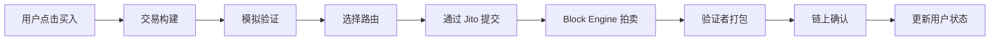

## 一次不一样的视角

2024 年初，Pump.fun 上线，我所在的团队开始认真讨论要不要做 Meme 交易。

那个时候没人知道这会演变成一个年收入十亿美金的赛道。当时大家的判断是"看起来像一阵风，可能三个月就过去了"。

两年过去了。Pump.fun 累计收入超过了 10 亿美金，Axiom 成为最快达到 2 亿美金收入的 Solana 应用，Jito 通过 MEV 基础设施捕获了超过 7.2 亿美金。这个从零诞生的市场，养活了一整条产业链。

我在这两年里，负责过 Meme 交易平台的核心链路 —— 从 Token 发现、价格数据、交易执行到狙击、跟单、自动化。见过系统过载在热门 Token 发射时瘫痪，也见过深夜接到告警 Jito Tip 飙到离谱。见过散户一晚赚一百万美元，也见过整个平台因为一笔三明治攻击损失上万美元。

这是我第一次系统地把这些东西写出来。

## 这个世界比你想的复杂

如果你只是普通用户，Meme 交易对你来说可能就是：打开 DEXScreener 看新币 → 打开 Axiom 点"买入" → 等涨等跌。

但从平台方的角度看，每一笔这样的交易背后是：



中间任何一环出问题，用户就会看到"交易失败"或者"滑点超限"。

而这只是写给用户看的简化版。真实的执行链路里还有：RPC 健康检查、Priority Fee 动态计算、Compute Unit 精确设置、Jito Tip 智能竞价、失败重试策略、去重机制……

## 这个市场的真实图景

两年下来，我画了一张这个世界的"食物链图"。它能帮你快速理解钱是怎么流动的：

```
┌─────────────────────────────────────────────┐
│              基础设施层（收租者）             │
│  Solana 验证者 · Jito · RPC 服务商 · DEX     │
├─────────────────────────────────────────────┤
│              平台层（服务商 + 收费者）        │
│  发射台 · 交易平台 · 数据平台 · 钱包          │
├─────────────────────────────────────────────┤
│              专业玩家层（信息差获利者）       │
│  狙击手 · MEV 机器人 · 做市商 · Cabal         │
├─────────────────────────────────────────────┤
│              用户层（流动性提供者）           │
│  散户 · KOL 粉丝 · 跟单者 · 新手             │
└─────────────────────────────────────────────┘
                    ↑
              钱从下往上流
```

越往上，越稳定，越不被市场涨跌影响。越往下，越容易被收割。

我自己做的就是第二层「平台层」的事情。坐在中间看，能看到两头的事情：基础设施层怎么把我们当客户宰，用户层怎么被我们和上面的几层一起宰。

这听起来不好听，但这就是这个市场的结构性事实。

## 普通人能看到的数据 vs 真实的数据

举个例子。你在 DEXScreener 上看到一个 Token 24 小时交易量 $500K，你会觉得这个 Token 有热度。

从平台方视角看，我大概能估算出：

- 其中可能有 30%-70% 是刷量（关联地址反复交易）
- 真实独立买家可能只有几十个
- 价格波动的大部分能量来自 5-10 个关联钱包
- 背后很可能有一个「Cabal」（秘密协调的操盘小圈子）在运作

这不是阴谋论。链上数据是透明的，只要有工具就能看出来。平台方有全局视角，能看清这些模式。但我们为什么不拦截这些 Token？因为它们也贡献交易量、也贡献手续费。商业决策和道德判断之间，总是有一条模糊的线。

## 为什么这个赛道这么疯狂

如果你问我："Meme 交易到底为什么能成为一个市场？"我的答案不是"因为 Solana 便宜"，而是：

**Pump.fun 把「发一个币」这件事，从一个工程问题变成了一个一键操作。**

在 Pump.fun 之前，在 Solana 上发币要：

- 懂 Rust/Anchor 写合约
- 手动创建 Raydium 流动性池
- 准备初始流动性资金
- 整个过程数小时到数天

在 Pump.fun 之后：

- 填一个名字、一张图
- 花不到 2 美元
- 30 秒搞定

这不是"量变"，这是新创造了一个市场。就像 YouTube 不是"更好看的电视"，而是创造了一个完全新的内容产业。

当"发一个币"变成一个可以批量化的操作，围绕它的所有配套（交易、分析、安全检测、自动化工具）就被需求拉动起来。每天数万个新 Token 产生的数据流，需要平台处理；数百万用户的交易行为，需要基础设施支撑；数千亿美金的交易量，最终形成了这个产业。

## 这个系列接下来会写什么

这是《Meme 交易平台深挖》系列的第一篇。接下来我计划写：

1. **《Solana 为什么赢了 Meme 交易这一局》** — 从技术、生态、时机三个维度分析
2. **《一笔 Solana 交易的一生》** — 从用户点击到链上确认的完整旅程
3. **《Pump.fun 如何凭空造了一个十亿美元市场》** — 产品视角的复盘
4. **《Jito 到底是什么，为什么每个交易平台都离不开它》** — MEV 基础设施的深度解读
5. **《做一个 Telegram 交易 Bot 到底有多难》** — 工程细节的全景拆解

如果你对这些话题感兴趣，
<a href="/rss.xml">订阅 RSS</a>
或
<a href="https://x.com/FrankFu2262">关注我的 X</a>
就能第一时间看到更新。

更完整的内容我放在了 GitHub：[meme-trade-wiki](https://github.com/survivorff/meme-trade-wiki) —— 一个面向开发者的完整知识库，8 章 41 篇。

---

_Building in public. Learning out loud._
