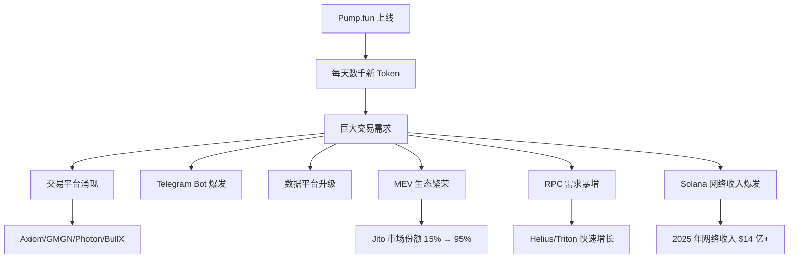

## 一个不起眼的产品

2024 年 1 月，Pump.fun 上线。

当时没有几个人认真对待它。功能看起来很简单：让任何人花 2 美元就能发一个 Token，然后在上面交易。发币这件事在以太坊生态已经存在多年，Pump.fun 看起来只是"又一个山寨的发币工具"。

然后它走到了：

| 数据                                | 规模        |
| ----------------------------------- | ----------- |
| 累计收入                            | $10.8 亿+   |
| 2025 年收入                         | $6.64 亿    |
| 2024 年收入                         | $3.21 亿    |
| 累计创建 Token 数                   | 1300 万+    |
| 占 Solana 全部 Token 比例           | 超过 1/3    |
| 单日最高 Token 创建量               | 71,000      |
| ICO + 私募融资                      | $13 亿      |
| 首个达到 $1 亿 Solana 应用          | ✅ 历史最快 |
| 首个 Solana 应用突破 $10 亿累计收入 | ✅          |

这是加密货币历史上最成功的单一应用之一。

作为一个「旁观者 + 建造者」，我把这件事的发生过程复盘了一遍。得出一个结论：**它不是运气好，它是方法论的胜利。**

---

## 做对的三件事

### 第一件：把发币门槛降到近乎零

Pump.fun 之前，在 Solana 上发币要：

- 会 Rust / Anchor 写合约
- 自建流动性池
- 准备初始资金（通常 $500+ 的流动性）
- 数小时到数天的部署过程

Pump.fun 之后：

- 填一个名字
- 上传一张图
- 花 $2
- 30 秒搞定

**这不是"量变"，是创造了一个新市场。**

类比一下：

- YouTube 不是"更好看的电视"，它让任何人都能做"电视"
- Pump.fun 不是"更方便的发币工具"，它让任何人都能"发行资产"

门槛塌方级降低，参与者数量爆炸式增长。第一个月就有数千个 Token 被创建，一年后是每天数万个。

### 第二件：用 Bonding Curve 解决流动性冷启动

传统 Token 发行面临一个鸡生蛋的问题：

```
没有流动性 → 没人敢买 → 没人提供流动性 → 永远没有流动性
```

Pump.fun 的 Bonding Curve 机制巧妙地绕过了这个问题：

```
创建 Token（无需流动性）
    │
    ▼
价格由公式决定，随买入量上升
    │
    ▼
积累足够买盘（市值达到 $69K）
    │
    ▼
自动迁移到 DEX，完成流动性引导
```

**这个机制的精妙之处在于：它把"发币"和"做市"合二为一了。**

创建者不需要准备流动性，买家可以立即交易，价格发现完全由市场行为驱动。整个流程自动化、无摩擦、公平（相对而言）。

### 第三件：创造了一个可玩的标准化游戏

Pump.fun 上的每个 Token 都遵循相同的生命周期：

1. 创建
2. Bonding Curve 交易
3. 毕业到 DEX
4. 自由交易

**这种标准化让投机变得"可玩"：**

- 交易者知道规则是什么（不像传统山寨币五花八门）
- 可以开发策略（狙击、跟单、趋势交易）
- 可以用工具自动化
- 可以形成完整的玩家生态

**本质上，Pump.fun 创造了一个标准化的赌场游戏。** 规则统一、玩法多样、参与门槛极低。这就是它能养起一个完整产业的根本原因。

---

## 生态爆炸的连锁反应

Pump.fun 的成功引发了一系列连锁反应：



**每一个链条上的玩家都在吃 Pump.fun 带来的红利。**

- 交易平台：Axiom 峰值月收入 $4900 万
- MEV 基础设施：Jito 2025 年捕获 $7.2 亿
- RPC 服务商：Helius 等赚得盆满钵满
- 验证者：因为有 MEV Tip，收入大幅增加
- 数据平台：DEXScreener、Birdeye 流量暴涨

这些玩家加起来，每年的收入大概 $20-30 亿。**Pump.fun 是这个生态的源头。**

---

## 护城河有多深

很多人尝试过挑战 Pump.fun：

- **LetsBonk.fun**（2025 年 4 月上线）：依托 BONK 社区，在 6-7 月一度超越 Pump.fun
- **Moonshot**：DEXScreener 推出，主打移动端和法币入金
- **Four.meme**：BSC 上的版本，对标 Pump.fun

结果怎样？

Pump.fun 在 2025 年下半年通过一系列动作夺回了 >90% 的市场份额：

1. **推出 PumpSwap**（自有 DEX），垂直整合
2. **发行 $PUMP Token**，ICO 融资 $13 亿
3. **Token 回购机制**：累计回购 65.4 万 SOL（约 $1.3 亿）
4. **降低创建者奖励门槛**，吸引更多 Meme 创作者

**为什么挑战者很难成功？**

发射台的竞争本质是**网络效应的竞争**：

```
更多 Token 创建 → 更多交易者来 → 更多交易量
      ↑                                │
      └────── 更多创建者被吸引 ←────────┘
```

一旦这个循环转起来，后来者要打破几乎不可能。LetsBonk 虽然短暂超越，但 Pump.fun 通过降费+功能升级很快拿回主导地位。

---

## 学到了什么

Pump.fun 的故事给我最大的启发是**"降低门槛就是创造市场"**。

不是去满足现有需求，而是**降低门槛让新需求涌现**。

类似的案例：

- **YouTube**：把视频发布门槛从"需要电视台"降到"打开摄像头"，创造了 UGC 视频产业
- **Shopify**：把开网店门槛从"需要技术团队"降到"填表格"，创造了 DTC 电商
- **ChatGPT**：把使用大语言模型门槛从"会写代码调 API"降到"在对话框输入"，创造了 AI 消费产品市场
- **Pump.fun**：把发币门槛从"懂 Rust + 准备流动性"降到"填表 + $2"，创造了 Meme 交易产业

**每一次门槛的塌方式下降，都对应着一个新市场的诞生。**

作为开发者，我一直提醒自己：

- 不要问"用户现在想要什么"，问"用户被什么阻拦了"
- 不要只做"更好一点"的产品，做"从 10 步到 1 步"的产品
- 一旦门槛被突破，不要担心需求不够，担心的是你能不能接住涌来的需求

---

## 系列文章

《Meme 交易平台深挖》系列：

- [第 1 篇：交易所工程师眼中的 Meme 交易世界](/posts/exchange-engineer-view-of-meme/)
- [第 2 篇：Solana 为什么赢了 Meme 交易这一局](/posts/why-solana-won-meme/)
- [第 3 篇：一笔 Solana 交易的一生](/posts/lifecycle-of-solana-tx/)
- _第 4 篇：本文_

下一篇：《Jito 到底是什么，为什么每个交易平台都离不开它》
