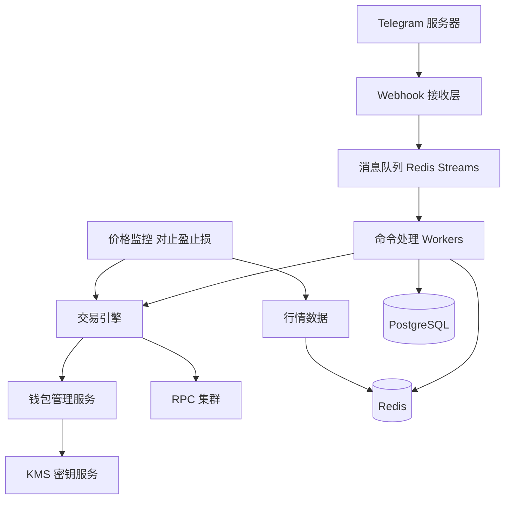

## 一个看起来简单的东西

Telegram 交易 Bot 长这样：

```
用户 → /buy abc123 1
  Bot → 买入成功，成交价 0.0012，持仓 833.33
```

就这么几行对话，背后是什么？

很多新手看到这个会觉得：这不就是写个 Telegram Bot + 连接 Solana RPC + 调个 Swap 吗？几百行代码就能搞定。

然后真正做一个能跑起来的 Bot，他们会在无数细节上卡死 —— 托管钱包安全、交易失败处理、速度优化、并发管理、用户状态同步……

这篇文章把这些坑拉一遍，帮你理解做一个"生产级" Telegram 交易 Bot 到底需要什么。

---

## 表面架构

最基础的 MVP 架构：

```
Telegram 服务器
  │ (webhook 或 polling)
  ▼
Bot 后端（Node.js / Rust / Go）
  ├─ 命令解析
  ├─ 用户钱包管理
  ├─ Solana RPC 调用
  └─ 数据库（用户、持仓、历史）
  │
  ▼
Solana 网络
```

写一个 Demo 级别的大概 500-1000 行代码就能搞定。**但这种 Demo 没法接真实用户。**

---

## 真实架构的 10 个"坑"

### 坑 1：钱包安全

Bot 的第一个问题：用户的私钥放哪里？

- **方案 A：托管（主流）**
  - 用户在 Bot 里创建钱包，私钥由 Bot 服务器保管
  - 优点：速度最快，体验最好
  - 缺点：你要为所有用户的资金安全负责

- **方案 B：非托管**
  - 用户自己导入助记词或私钥
  - 优点：安全
  - 缺点：大部分用户不会用

90%+ 的 Telegram Bot 选了方案 A。这意味着你必须：

- 用 HSM / KMS 加密存储私钥
- 签名服务独立部署，网络隔离
- 操作审计日志
- 冷热钱包分离
- 多人多签管理管理员权限

**一次安全事故 = 整个 Bot 死亡 + 可能的法律问题**。历史上已经有多个 TG Bot 因为安全事故倒闭。

### 坑 2：Telegram API 的限制

Telegram 的 Bot API 有严格的速率限制：

- 单个聊天：每秒 30 条消息
- 全局：每秒 30 条消息（对同一个 Bot）

这意味着：

- 用户多了以后，你的通知消息可能发不出去
- 止盈止损触发时，通知会延迟
- 需要消息队列 + 限流

### 坑 3：用户状态管理

Telegram Bot 是无状态的。用户发 `/buy abc123 1`，Bot 要判断：

- 这个用户是新用户还是老用户？
- 他的默认滑点设置是多少？
- 他是不是在某个多步操作的中间（比如"请输入要买的金额"）？
- 他当前是否有未完成的订单？
- 他的风控状态是否正常？

所有这些状态要维护。典型的做法：

```
Redis（快速状态）：当前会话状态、命令上下文
PostgreSQL（持久状态）：用户设置、持仓、历史
```

### 坑 4：交易失败的用户体验

Solana 交易会失败，这是常态。但用户看到"交易失败"就会来找你：

- "为什么买不了？"
- "我的 SOL 去哪了？"
- "是不是你们 Bot 有问题？"

你需要：

- 区分不同失败原因（滑点、CU、流动性、网络）
- 用人话解释（不是 `Error: InstructionError: 0x1771`）
- 提供下一步建议（调高滑点、换金额、等一会再试）
- 如果是 Bot 侧的问题（RPC 挂了），要自动重试而不是抛给用户

### 坑 5：并发交易的原子性

一个用户的多笔交易要处理好顺序和隔离：

```
用户发送 /buy abc 0.1
用户立即又发 /sell abc all
```

这两笔交易不能并发执行，否则会乱。需要用户级别的锁：

```typescript
const userLock = await acquireLock(`user:${userId}`);
try {
  // 执行交易
} finally {
  userLock.release();
}
```

还要考虑：

- 用户同时在两个设备操作
- 自动交易（止盈止损）和手动交易冲突
- 跟单触发和用户主动操作冲突

### 坑 6：跟单的实时性和扩展性

假设你支持"跟单"功能，用户 A 跟单 5 个钱包。你需要：

- 实时监控这 5 个钱包的所有交易
- 解析每笔交易（是买入还是卖出？买的什么 Token？）
- 在 A 的钱包上复制这些操作

如果平台有 1 万个用户，每人跟 5 个钱包，平均每个钱包有 1000 个跟单者（热门钱包）...

这是一个**发布-订阅扇出**问题：一个钱包的动作，要触发成百上千个跟单交易。需要：

- 事件队列（Kafka / Redis Streams）
- 批处理优化
- 失败隔离（一个跟单失败不影响其他人）

### 坑 7：RPC 成本爆炸

Bot 需要大量的链上查询：

- 每次下单：查余额、查价格、查 Token 状态（3-5 次 RPC 调用）
- 每秒钟：同步所有活跃用户的持仓（大量调用）
- 实时监控：几十上百个 WebSocket 订阅

用商业 RPC（Helius、Triton）的话，一个中等规模的 Bot 月 RPC 费用可能 $5000-$50000。

优化策略：

- 缓存热点数据（Token 元数据、价格）
- 批量查询（getMultipleAccounts）
- 读写分离（读用便宜的 RPC，写用高端 RPC）
- WebSocket 订阅替代轮询

### 坑 8：Jito Tip 的动态定价

所有交易要通过 Jito 提交以保证成功率和防夹。但 Tip 多少合适？

- 太低：交易可能被丢弃
- 太高：吃掉用户利润

需要动态计算：

```typescript
async function getOptimalTip() {
  // 查询最近 20 个区块的 Tip 分布
  const recentTips = await fetchRecentJitoTips();
  // 根据网络拥堵程度选择百分位
  const congestion = getCongestionLevel();
  if (congestion === "high") return percentile(recentTips, 75);
  if (congestion === "normal") return percentile(recentTips, 50);
  return percentile(recentTips, 25);
}
```

这个算法本身就是一个小系统，要实时跑。

### 坑 9：止盈止损的可靠性

用户设置"涨到 2x 自动卖出"。你需要：

- 持续监控这个 Token 的价格（每几百毫秒一次）
- 触发条件后立即构建卖出交易
- 交易失败后重试
- 通知用户结果

**这里最大的陷阱**：如果服务器宕机，止盈止损就不触发。用户会亏损，甚至告你。

你需要：

- 高可用部署（多实例 + 自动故障转移）
- 任务持久化（服务器挂了重启后能恢复）
- 分布式任务调度（避免单点）
- 兜底通知（即使平台故障，至少要能通知用户"监控中断"）

### 坑 10：反滥用和风控

Telegram 是一个公共平台，会有：

- 洗钱尝试（小额多次转入转出）
- 刷量（机器人伪装成用户做大量交易）
- 钓鱼攻击（用户被引导到假 Bot）
- DDoS（有人恶意刷请求耗你 RPC 配额）

需要：

- 用户行为分析
- 单用户请求频率限制
- 可疑交易的人工审核
- 防止 Bot 被恶意克隆（域名监控）

---

## 一个真实的架构

实际线上跑的 TG Bot 架构大概长这样：



组件多少：

- **核心服务**：8-12 个微服务
- **数据库**：1-2 个 PG 集群，1 个 Redis 集群，1 个 Kafka
- **基础设施**：多 RPC 节点，Jito 集成，监控告警
- **团队**：至少 3-5 个资深工程师，外加 devops 和安全专家

---

## 成本结构（估算）

一个月活 1 万、日交易量 $500 万的 TG Bot 大概的成本：

| 项目                      | 月成本            |
| ------------------------- | ----------------- |
| RPC 服务                  | $5K-$15K          |
| 服务器（云）              | $3K-$8K           |
| Jito Tip 垫付（部分场景） | $2K-$10K          |
| 监控告警服务              | $500-$2K          |
| KMS / HSM                 | $500-$2K          |
| 团队（核心 3 人）         | $30K-$60K         |
| **总计**                  | **$40K-$100K/月** |

收入端：以 1% 手续费计算，日交易量 $500 万 = 手续费 $1500/日 = 月 $45K。

**这就是为什么早期很多 TG Bot 活不下来** —— 收入勉强覆盖成本，没利润。

真正赚钱的都是达到规模效应的头部（BONKbot、Trojan、Maestro），日交易量上千万美元级别，才有稳定的利润。

---

## 给新手的建议

如果你考虑做一个 Telegram 交易 Bot：

1. **先想清楚商业模式**，不是"技术能做"就"应该做"
2. **安全放第一位**，一次事故毁所有
3. **做好失败场景**，交易失败处理比成功路径重要
4. **RPC 成本会吃掉你**，从第一天就要优化
5. **考虑合规风险**，各地监管态度在变

另一个思路：**不做整个 Bot，做里面的某个组件**。比如：

- 做专业的跟单引擎，授权给其他 Bot 使用
- 做 Token 安全评分 API，平台付费接入
- 做 RPC 聚合服务，解决多个 Bot 的共同痛点

**在已经饱和的赛道直接竞争，不如做水电煤。**

---

## 系列文章

《Meme 交易平台深挖》系列（共 6 篇）：

- [第 1 篇：交易所工程师眼中的 Meme 交易世界](/posts/exchange-engineer-view-of-meme/)
- [第 2 篇：Solana 为什么赢了 Meme 交易这一局](/posts/why-solana-won-meme/)
- [第 3 篇：一笔 Solana 交易的一生](/posts/lifecycle-of-solana-tx/)
- [第 4 篇：Pump.fun 凭空造了一个十亿美元市场](/posts/how-pumpfun-created-market/)
- [第 5 篇：Jito 到底是什么](/posts/what-is-jito/)
- _第 6 篇：本文_

系列完结。下一个系列可能是《从 Web2 转 Web3 的工程师生存指南》，或者《交易所基建深挖》。

订阅 [RSS](/rss.xml) 或关注 [@FrankFu2262](https://x.com/FrankFu2262) 不错过更新。
